# Stories

### João Pedro dos Santos Ramos e Vinicius Rossoni Dias

## Objetivo
Criar lago semelhante aos Stories do Instagram, onde deveria ser possível aplicar filtros pré-definidos em um vídeo e/ou imagem e permitir o usuário adicionar stickers nesse video/imagem.

## Executando projeto

Para executar o projeto, é necessário ter o Python instalado, e baixar as dependências listadas no arquivo [requirements.txt](requirements.txt). Após isso, basta executar o arquivo [window.py](src/window.py).

## Como usar

O projeto consiste de três principais funcionalidades, trocar o filtro atual, colocar/remover stickers da tela mediante o mouse, e capturar uma foto.

O programa executando ficará assim:

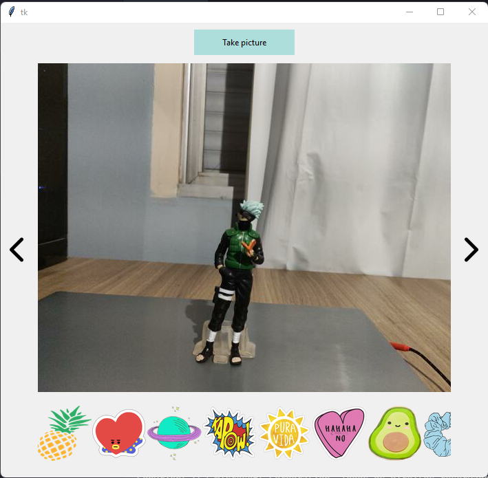

### Trocar filtro

Para trocaro filtro atual, basta avançar ou retroceder através das setas na direita e na esquerda.

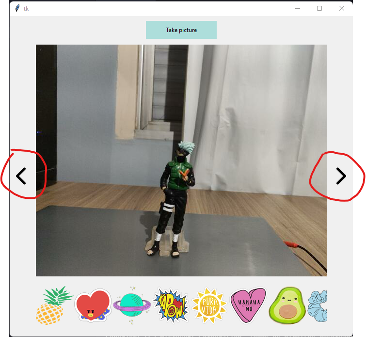

### Colocar stickers na tela

Usando a barra de stickers abaixo da imagem, basta selecionar o stickers desejado e arrastar até a tela.

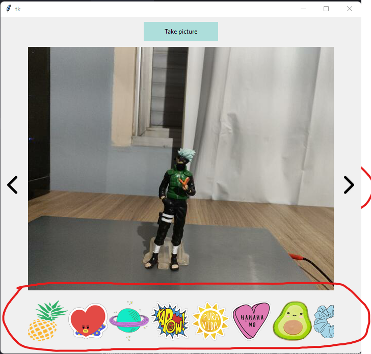

### Capturar foto

Depois que o filtro desejado ter sido escolhido, e os stickers colocados na tela, para capturar a foto, basta clicar no botão *Take picture*, a foto ficará salva na pasta [screenshots](imgs/screenshots).

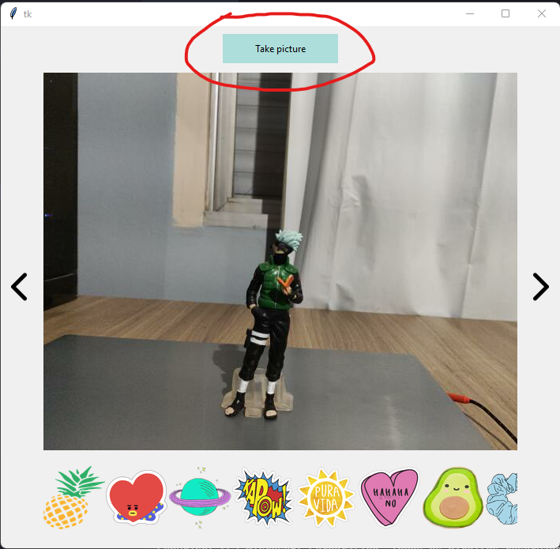

## Filtros

Foram usados 4 filtros no total:

- Negativo
- Foco em um círculo no centro da tela
- Portrait mode
- Sepia

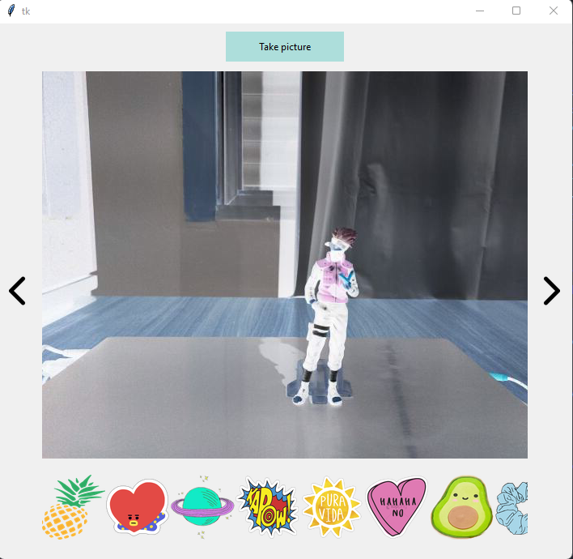
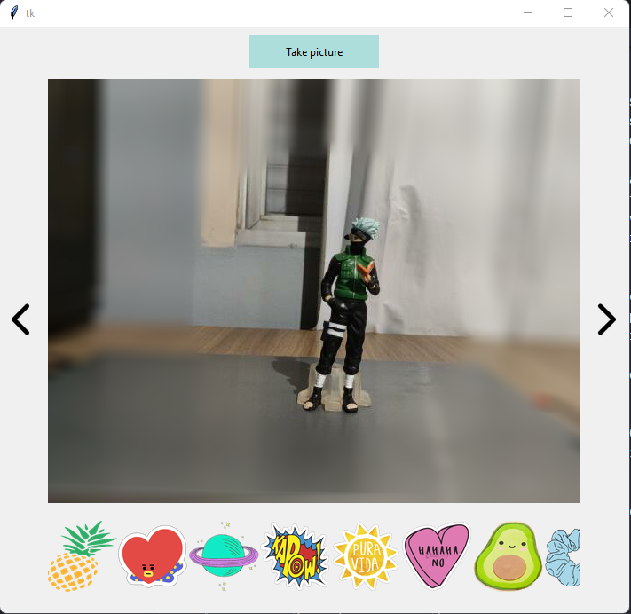
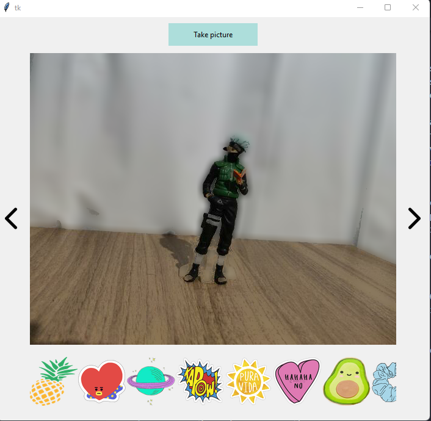
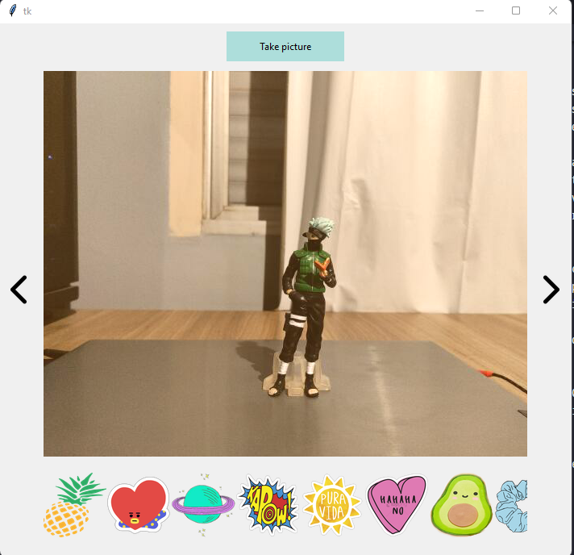

## Stickers

Abaixo segue alguns exemplos com os stickers sendo utilizados:

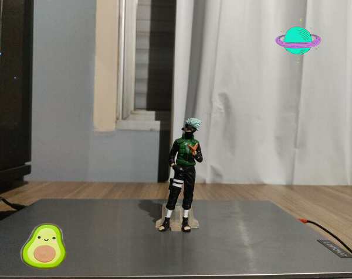
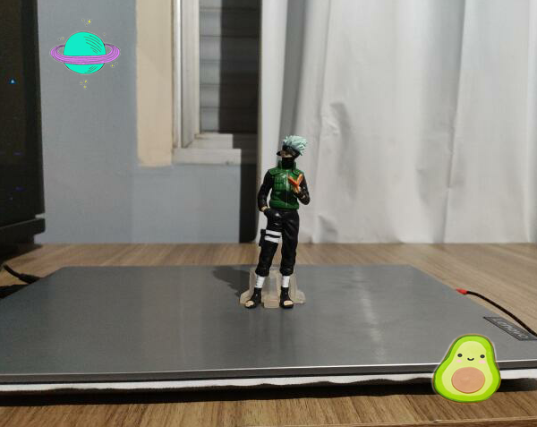
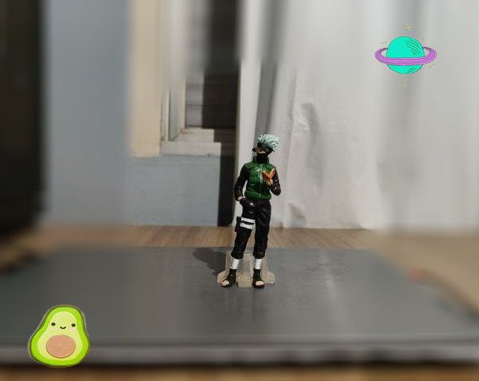
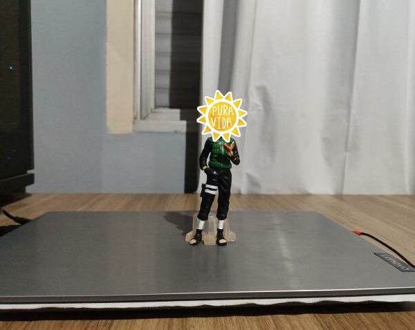

Todas as fotos foram tiradas na mesma execução do programa.

## Código

O programa consistem de dois principais arquivos:

- [effects.py](src/effects.py)
- [window.py](src/window.py)

### Effects.py

Esse arquivo concentra os filtros, onde basicamente são funções em que é passado um *frame* como paramêtro, e ela devolve o *frame* com o filtro aplicado, e a classe que gerencia o filtro atual.

Principais funções:

- no_effect
- invert
- circle_focus_blur
- portrait_mode
- sepia

*no_effect*: Apenas retorna o frame passado, é usado para não aplicar filtro nenhum.
```py
  def no_effect(frame):
    return frame
```

*invert*: Inverte o frame passado.
```py
def invert(frame):
    return np.invert(frame)
```
Usa o np.invert para fazer a inversão, com a bittwise_not tivemos alguns problemas para exibir, por isso optamos fazer assim.

*circle_focus_blur*: Desfoca a área ao redor de um círculo no centro da tela.
```py
def circle_focus_blur(frame, intensity=0.2):
    frame = maybe_add_alpha_channel(frame)
    frame_h, frame_w, frame_c = frame.shape
    y = int(frame_h/2)
    x = int(frame_w/2)
    radius = int(x/2)
    center = (x, y)
    mask = np.zeros((frame_h, frame_w, 4), dtype='uint8')
    cv2.circle(mask, center, radius, (255, 255, 255), -1, cv2.LINE_AA)
    mask = cv2.GaussianBlur(mask, (21, 21), 11)
    blured = cv2.GaussianBlur(frame, (21, 21), 11)
    blended = alpha_blend(frame, blured, 255-mask)
    frame = cv2.cvtColor(blured, cv2.COLOR_BGRA2BGR)
    return frame
```
Calculando a área do círculo no centro, é feito um blur em volta dele.

*portrait_mode*: Cria um efeito de modo retrato, onde um objeto fica focado e o resto em volta dele fica com efeito de blur.
```py
def portrait_mode(frame):
    frame = maybe_add_alpha_channel(frame)
    gray = cv2.cvtColor(frame, cv2.COLOR_BGR2GRAY)
    _, mask = cv2.threshold(gray, 120, 255, cv2.THRESH_BINARY)
    mask = cv2.cvtColor(mask, cv2.COLOR_GRAY2BGRA)
    blured = cv2.GaussianBlur(frame, (21, 21), 11)
    blended = alpha_blend(frame, blured, mask)
    frame = cv2.cvtColor(blended, cv2.COLOR_BGRA2BGR)
    return frame
```
A imagem é convertida para cinza, para poder ser usado o threshold, após isso é criado um blur no resultado do threshold.

*sepia*: Modifica o RGB para criar um efeito de uma foto mais quente, mais puxada para o vermelho.
```py
def sepia(frame, intensity=0.5):
    blue = 20
    green = 66
    red = 112
    frame = color_overlay(frame,
                          intensity=intensity,
                          blue=blue, green=green, red=red)
    return frame
```

*EffectsManager*: Essa classe é responsável por gerenciar o efeito selecionado:
```py
class EffectsManager:
    def __init__(self):
        self.selected_position = 0
        self.effects = [no_effect, invert,
                        circle_focus_blur, portrait_mode, sepia]
        self.selected = self.effects[self.selected_position]

    def apply_effect(self, frame):
        return self.effects[self.selected_position](frame)

    def next_effect(self):
        next_position = self.selected_position + 1

        if next_position < len(self.effects):
            self.selected_position = next_position
        else:
            self.selected_position = 0

        self.selected = self.effects[self.selected_position]

    def previous_effect(self):
        next_position = self.selected_position - 1

        if next_position >= 0:
            self.selected_position = next_position
        else:
            self.selected_position = len(self.effects) - 1

        self.selected = self.effects[self.selected_position]
```
Ela cria uma lista de efeitos, a posição na lista do efeito selecionado, e o efeito selecionado em si, possuí três principais funções:

- *apply_effect*: Aplica o efeito atual
- *next_effect*: Avança para o próximo efeito da lista
- *previous_effect*: Retorna para o efeito anterior da lista

### Window.py

Esse arquivo cria a tela, os botões, stickers e possibilita o drag'n drop dos stickers. Possui 4 princpais funções:

- main
- move
- show_frames
- take_picture

*main*: Cria a janela principal, os botões para trocar de filtro, e um canvas principal, onde fica o vídeo da camêra, e os stickers, eles ficam no mesmo canvas para haver a interação de arrastar os stickers para a tela principal

*take_picture*: Captura uma foto da posição especificada da tela, salvando na pasta screenshots, é usado uma variável de contador para não sobreescrever as imagens.

*show_frames*: Função usada para se comunicar com o OpenCV, converte a imagem capturada pela camêra através do OpenCV para um tipo de imagem que o Tkinter entenda, essa função chama ela mesma a cada 60 milisegundos.

*move*: Função executada quando um sticker é movimentado, trackeando a posição atual dele para futuras movimentações.

## Considerações finais

O projeto teve um esforço maior para poder ser o mais simpes e intuitivo de usar, devido a isso trade offs tiveram que ser feitos, como por exemplo a foto capturada, que devido a limitação dos stickers teve que ser feita através do Tkinter, e não do OpenCV.

## Fim
